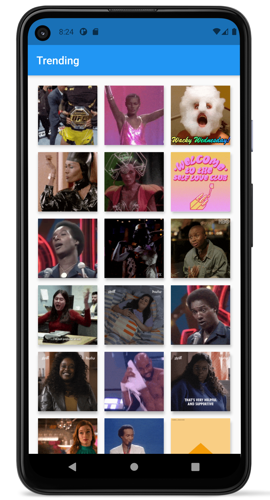

# gif_search

## Getting Started with Flutter

Learning Flutter in practice - Challenge 2: a gif search app

### Goals
- Using GridView
- Images
- Web request
- Navigation
- Deserialization (JSON)

___
[Challenge 1: a simple notes app](https://github.com/luandersonn/notes-flutter)
